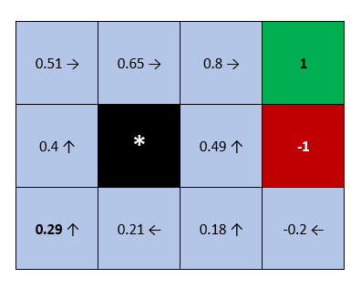
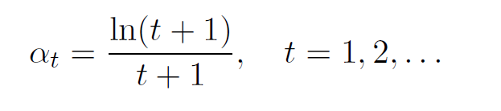

# Q-learning & Q-value iteration algorithms for the Block World Environment

## Motivation
This is the implementation of the Reinforcement Learning homework for the Machine Learning class at the School of Electrical Engineering, University of Belgrade.

## Block World environment
The environment originates from the book by [Russel & Norvig](http://aima.cs.berkeley.edu/). 

Green and red fields are terminal states. Green field represents victory and it's reward is **+1**, while the red one represents defeat and it's reward is **-1**.  
For each move the agent performs, it receives a small reward of: **-0.04**. The black field represents a wall. If the agent tries to go into that field or outside of the borders of the world it will remain in the same position/field.

## Q-value iteration algorithm
It is important to note that this algorithm assumes that we are familiar with the [***Markov Decision Process***](https://en.wikipedia.org/wiki/Markov_decision_process).

### Slip probability
When the agent decides to perform a certain action there is some probability that the agent will slip an end up in some other state. More specifically, when agent slips it can end up going in one of the directions which are orthogonal to the target one. Example: Agent wants to go to the ease, but can end up going to the north or south.
 
Below you can see some analysis related to this subject. In this analysis a discount factor of 0.9 was used.

#### Slip probability=0.2
In this case agent goes to the target direction with probability of 0.8, but goes in orthogonal directions with probability 0.2 (0.1 each).
 
The algorithm converges after 17 iterations.  
 
Below we can see how optimal actions change for each field during iterations.
 

 

Here we can see what are the optimal actions after the algorithm has converged and what are the according V-values. V-values are basically maximum Q-values for each state. In another words: for each state ***s*** we calculate the ***Q(s,a)*** pairs (by analyzing every action possible in that state). Then we set the ***V(s)*** to be equal to the maximum Q(s,a). 
 

#### Slip probability=0.6
In this case agent goes to the target direction with probability of 0.4, but goes in orthogonal directions with probability 0.6 (0.3 each).
 
The algorithm converges after 34 iterations.  
 
Here we can see what are the optimal actions after the algorithm has converged and what are the according V-values.
 

### Discount factor
Below we can see how the discount factor influences the performance. The analysis was performed with slip probability 0.2.
 

#### Discount factor=0.9
The algorithm converges after 17 iterations.
 

 

#### Discount factor=1.0
In this case the algorithm converges after 24 iterations.  
Besides the V-values being higher than in the previous case (which was expected), we can notice some differences when it comes to optimal actions in the bottom row. This is because we are giving much more significance to the negative one-step-award: -0.04. 

 

## Q-learning
Maybe the main difference of this algorithm with respect to the previous one, is the fact that here we are not familiar with the *Markov Decision Process*.

### Policy
For deciding which actions the agent should perform, **ε-greedy** policy was used, with ε being set to **0.2**. That means that in 20% of the time our agent performs an action randomly, and in 80% of the time it chooses an optimal action in the current state: **s** based on the Q(s,a) pairs.

Below we can see what are the optimal actions and according V-values for each state. These results were obtained by using adaptive learning rate (which is explained a bit alter).

### Learning rate

#### Adaptive learning rate
At the start of each episode we decay the learning rate with respect to the equation below.  
***t*** indicates the episode number

#### Constant learning rate
If we use constant learning rate the algorithm does not converge nicely. Also the choice for that constant value is really important. Below we can see how the V-values change during episodes (only a subset of them) for two different learning rates:
* α = 0.1 --- Chosen randomly
* α = 0.0125 --- Learning rate which we would get after 100 episodes using the equation above.

It is confirmed that the smaller values result in nicer convergence, but this is not ultimately correct. In another words we need to progressively redice the learning rate.
